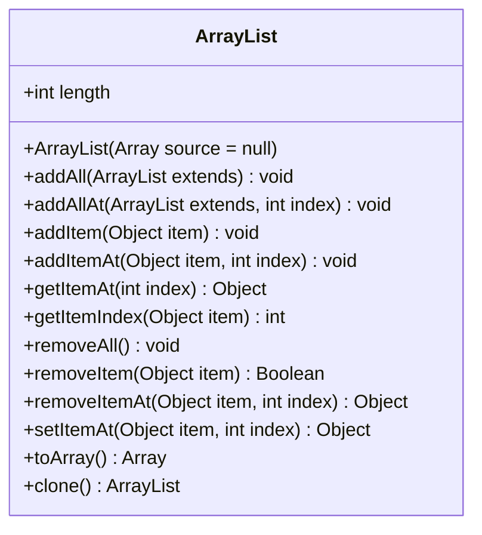

# ArrayList

**public method**
| Method  |
| ------------- |
| **ArrayList(source: Array = null)**   Construct a new ArrayList using the specified array as its source. |
| **addAll(extends: ArrayList ): void**    Adds a list of items to the current list, placing them at the end of the list in the order they are passed.|
| **addAllAt(extends: ArrayList, index: int): void**    Adds a list of items to the current list, placing them at the position index passed in to the function.|
| **addItem(item: Object): void**    Add the specified item to the end of the list.|
| **addItemAt(item: Object, index: int): void**    Add the item at the specified index.|
| **getItemAt(index: int ): Object**   Get the item at the specified index.|
| **getItemIndex(item: Object): int**    Return the index of the item if it is in the list such that getItemAt(index) == item.|
| **removeAll(): void**    Remove all items from the list.|
| **removeItem(item: Object): Boolean**    Removes the specified item from this list, should it exist.|
| **removeItemAt(item: Object, index: int): Object**    Remove the item at the specified index and return it.|
| **setItemAt(item: Object, index: int): Object**    Place the item at the specified index.|
| **toArray() : Array**    Return an Array.|
| **clone() : ArrayList**  Returns a shallow copy of this ArrayList instance. |

**reference**
- [mermaid](https://mermaid-js.github.io/mermaid/#/classDiagram?id=configuration)
