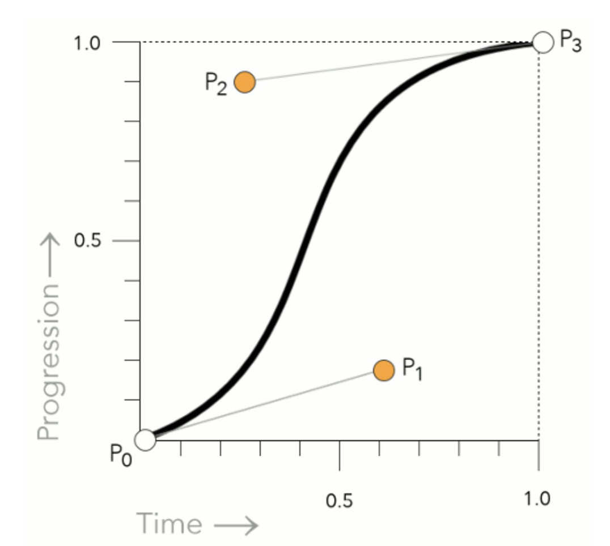

# 貝茲曲線 cubic-bezier 練習題

## 題目 1：理論基礎
請用自己的話解釋：
1. 什麼是貝茲曲線？
2. CSS 中的 cubic-bezier(x1, y1, x2, y2) 四個參數分別代表什麼？
   
3. 請說明 ease、ease-in、ease-out、linear 分別對應哪些 cubic-bezier 值？

## 題目 2：視覺化理解
請到 https://cubic-bezier.com/ 網站：
1. 試著調整控制點，觀察曲線變化
2. 截圖並說明 cubic-bezier(0.25, 0.1, 0.25, 1) 的動畫特性
3. 找出一個「先快後慢」的貝茲曲線參數

## 題目 3：基礎動畫實作
請設定一顆按鈕，並為他添加懸停(hover)動畫，請使用 cubic-bezier 實現平滑的上升和陰影效果。

## 題目 4：設計動畫
用 CSS 創造一個「跳躍的球」動畫：
1. 球要有重力感（下落時加速，上升時減速）
2. 落地時要有輕微回彈的效果
3. 使用至少 2 種不同的 cubic-bezier 曲線
4. 讓動畫看起來盡可能符合物理定律

---

### 延伸學習
推薦工具與資源：
-  [cubic-bezier.com](https://cubic-bezier.com/#.17,.67,.83,.67) - 互動式貝茲曲線編輯器
-  [easings.net](https://easings.net/) - 各種緩動效果範例
- [Ceaser](https://matthewlein.com/tools/ceaser) - CSS 緩動動畫生成器

