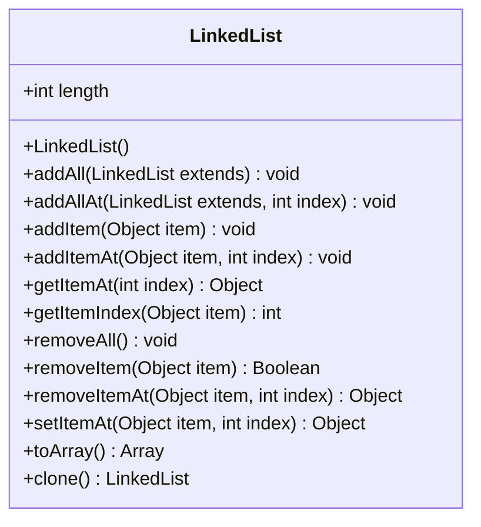

# LinkedList

Implement a class as described and write unit tests for all public methods.

note: use Object Implement.

**Demand**
1. software Versioning scheme use  [semver](https://semver.org/) .
2. build your project structure with [vite](https://vitejs.dev/guide/#scaffolding-your-first-vite-project).

3. unit test
 > - use [jest](https://jestjs.io/).
 > - test all public method of LinkedList.

4. package Names reference 
    > - [naming rules for java](https://developpaper.com/naming-rules-for-java-packages/)
    > - [java Naming a Package](https://docs.oracle.com/javase/tutorial/java/package/namingpkgs.html)
5. write README.md

> > required item
> > > - Environment 
> > > - Getting Started
> > > - Script


 
**project architecture**
```text
indi
 |- base
 |   |- util
 |       |- Collection.js or ICollection.ts
 |       |- LinkedList.js or LinkedList.ts
 |- test
```

**Challenge project**
1. [typescript](https://www.typescriptlang.org/).


**Class diagram**


- - -

| Public Method  |
| ------------- |
| **LinkedList(source: Array = null)** <br/> Construct a new LinkedList using the specified array as its source. |
| **addAll(extends: LinkedList ): void**  <br/> Adds a list of items to the current list, placing them at the end of the list in the order they are passed.|
| **addAllAt(extends: LinkedList, index: int): void**  <br/> Adds a list of items to the current list, placing them at the position index passed in to the function.|
| **addItem(item: Object): void**  <br/> Add the specified item to the end of the list.|
| **addItemAt(item: Object, index: int): void**  <br/> Add the item at the specified index.|
| **getItemAt(index: int ): Object**  <br/>Get the item at the specified index.|
| **getItemIndex(item: Object): int**  <br/> Return the index of the item if it is in the list such that getItemAt(index) == item.|
| **removeAll(): void**  <br/> Remove all items from the list.|
| **removeItem(item: Object): Boolean**  <br/> Removes the specified item from this list, should it exist.|
| **removeItemAt(item: Object, index: int): Object**  <br/> Remove the item at the specified index and return it.|
| **setItemAt(item: Object, index: int): Object**  <br/> Place the item at the specified index.|
| **toArray() : Array**  <br/> Return an Array.|
| **clone() : LinkedList**  Returns a shallow copy of this LinkedList instance.<br/>|


**document tools reference**

- [mermaid](https://mermaid-js.github.io/mermaid/#/classDiagram?id=configuration)
